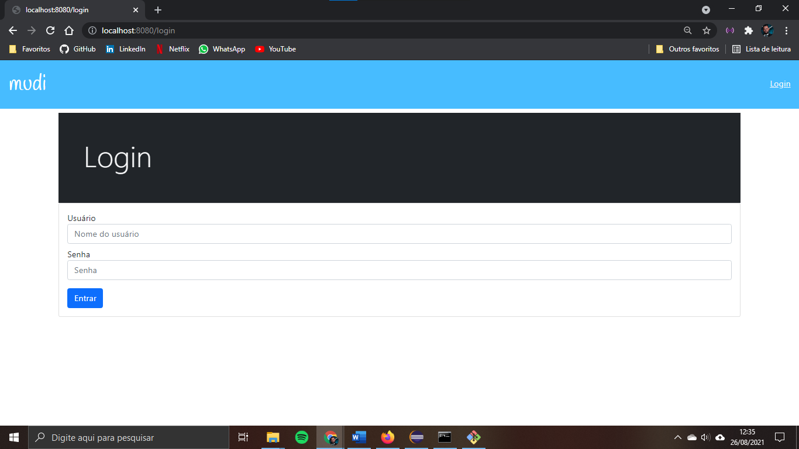
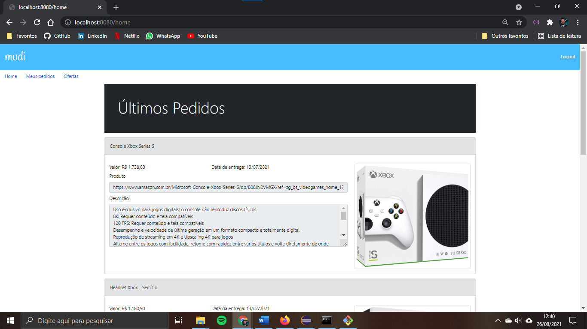
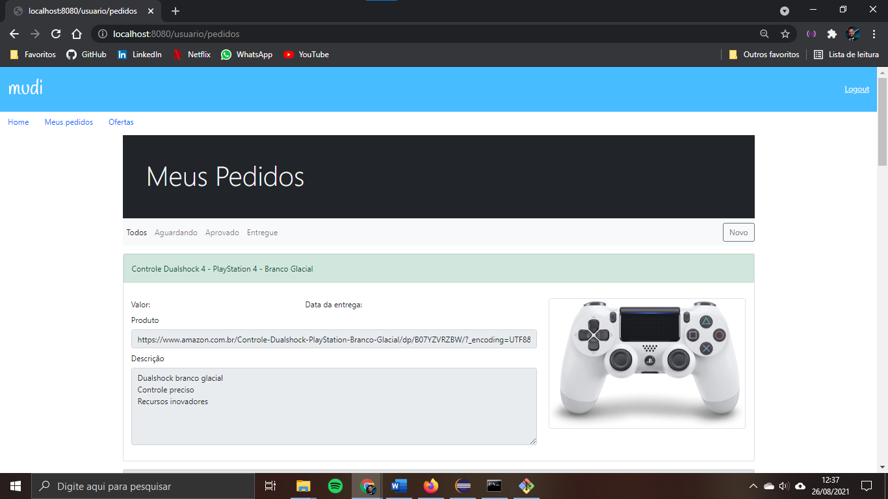
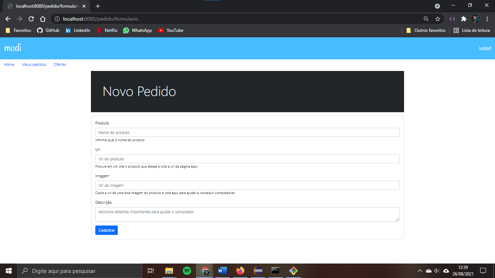
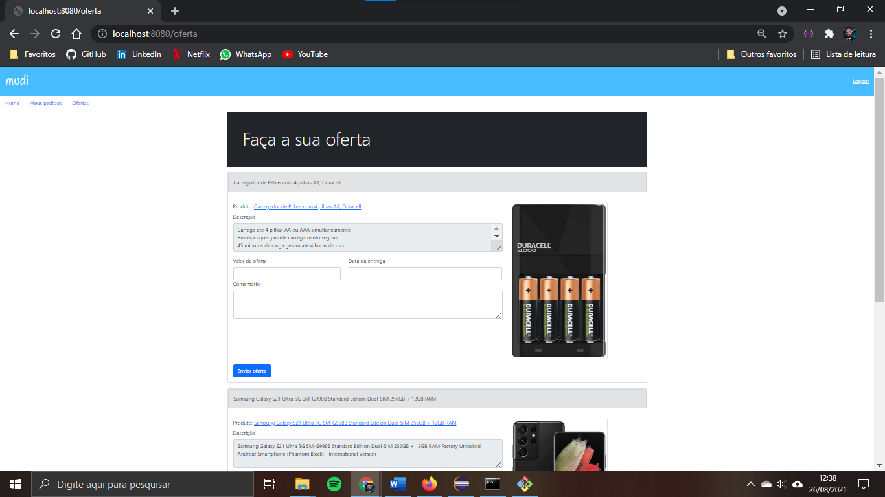

# Mudi

Aplicação para controle de ofertas e pedidos.

## Principais recursos utilizados

- Padrão MVC com o Spring MVC
- Spring Boot para configuração e servidor Tomcat
- Spring Data para persistência
- Views com Thymeleaf
- Validação de dados com o BeanValidation
- Injeção de dependências
- Spring Security para autorização e autenticação
- Estilização com o Bootstrap
- MariaDB

## Navegação

Login: `http://localhost:8080/login`  
Home: `http://localhost:8080/home/`  
Meus pedidos: `http://localhost:8080/usuario/pedidos`  
Novo pedido: `http://localhost:8080/pedido/formulario`  
Ofertas: `http://localhost:8080/oferta`  

# Telas

### Login

### Home

### Meus Pedidos

### Novo Pedido

### Ofertas

