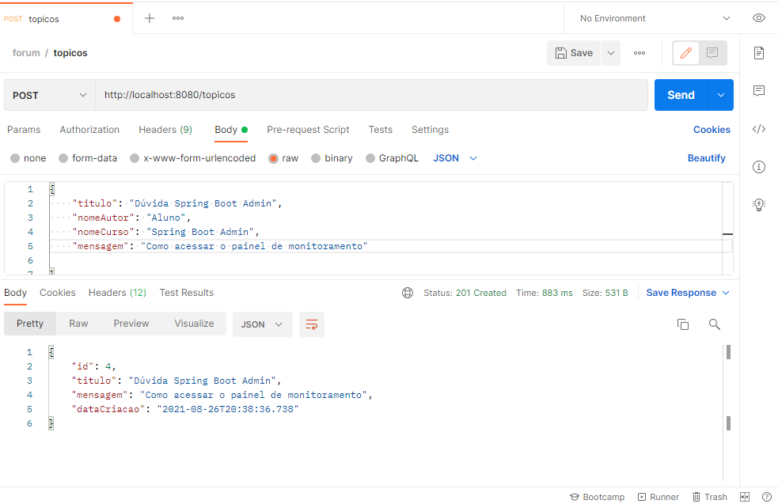
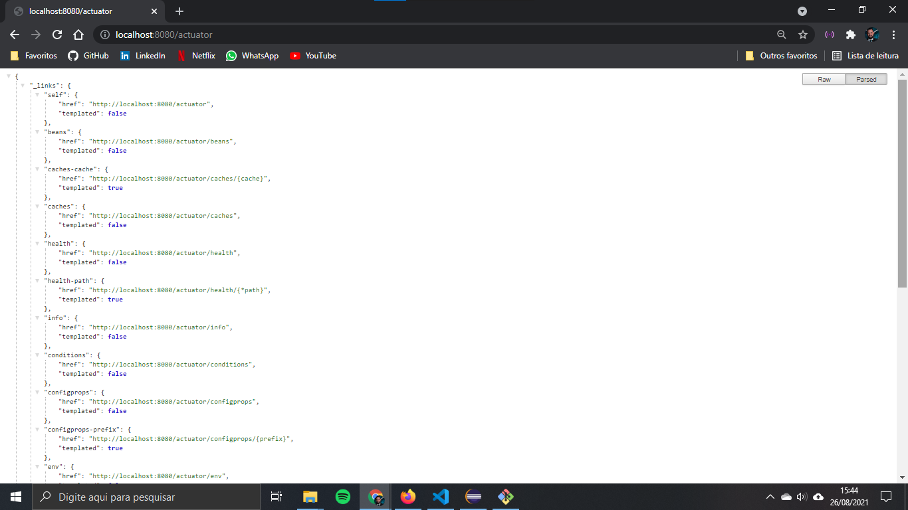
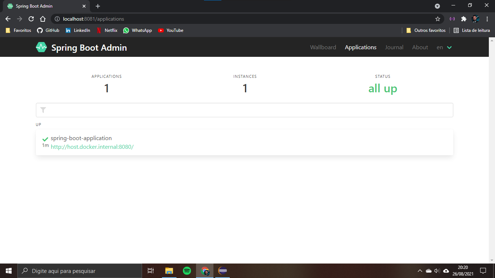
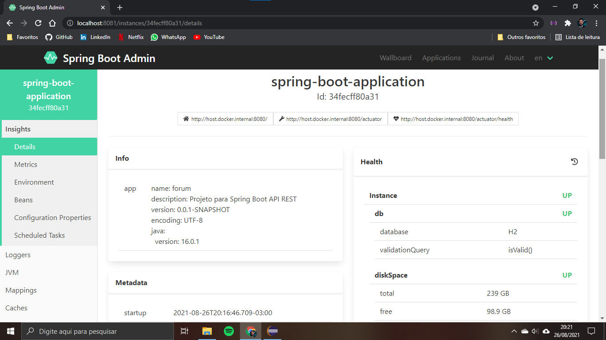
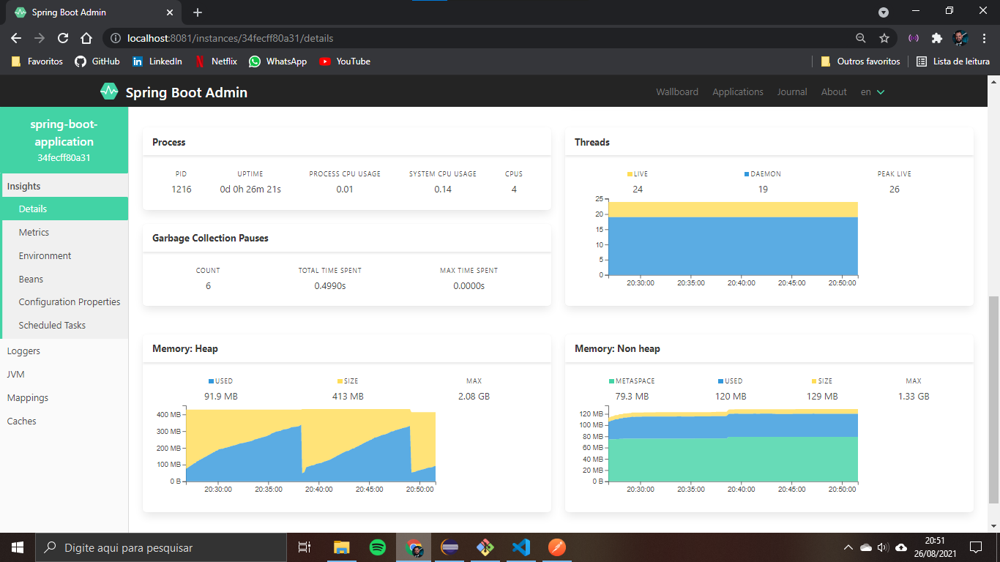
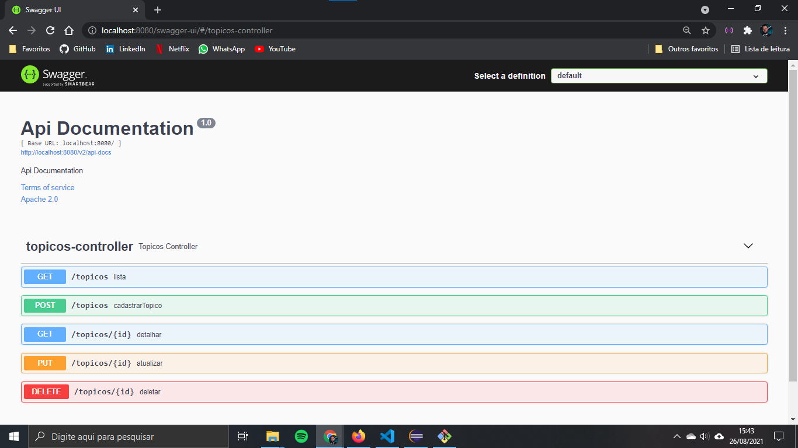
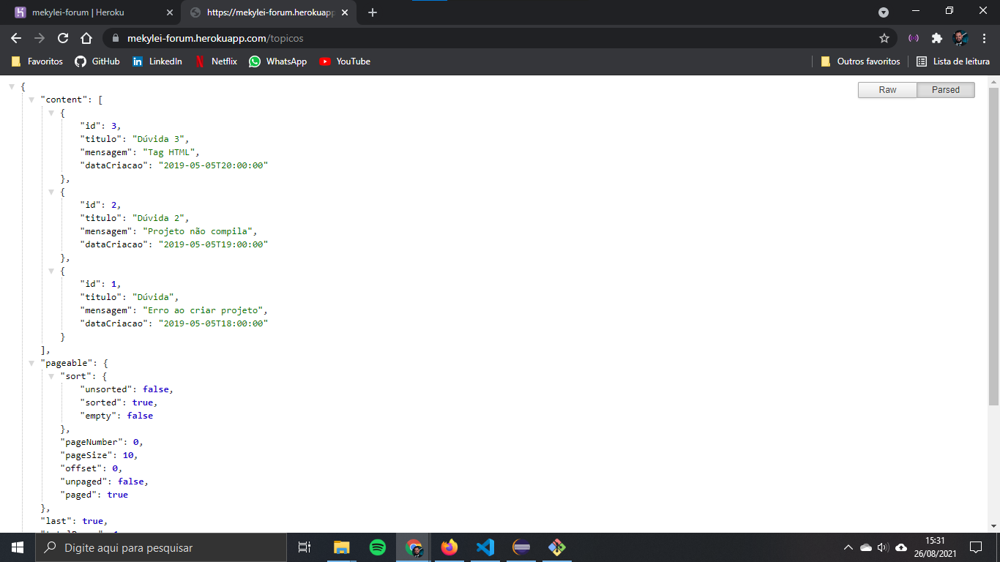

# API Rest com Spring Boot

API para disponibilizar endspoints de tópicos de um forúm.

## Principais recursos utilizados

- Arquitetura REST
- Spring Devtools
- Spring Boot
- Spring Data e BeanValidation
- Spring Security e JWT
- Monitoramento dos endpoints com Spring Boot Actuator e Admin
- Documentação da API com Swagger
- Deploy localmente, deploy com o Docker e deploy na nuvem com o Heroku
- H2 database

## Principais endpoints (dev)

Tópicos: `http://localhost:8080/topicos`  
Monitoramento com o actuator: `http://localhost:8080/actuator`  
Monitoramento com o spring boot admin: `http://localhost:8080`  
Swagger: `http://localhost:8080/swagger-ui/`  

# Telas

**Teste novo tópico (Postman)**  

**Monitoramento com o actuator**

**Monitoramento com o Spring Boot Admin**

**Documentação com o Swagger**

**Deploy na cloud com o Heroku**

